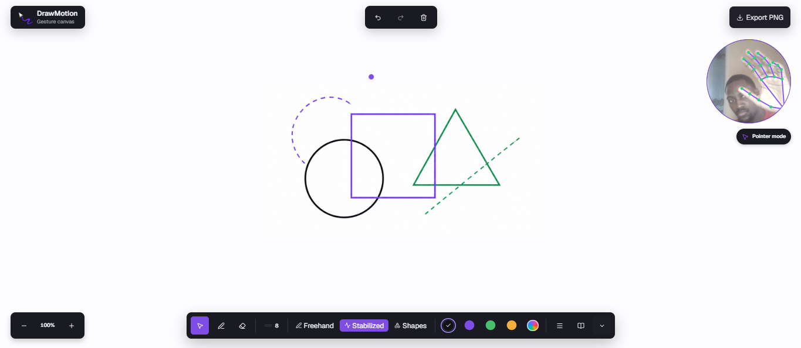

# DrawMotion

Draw in the air, directly in your browser. DrawMotion turns hand movements
captured by a webcam into 2D drawings: pinch to draw, release to lift the pen,
and make a fist to erase.

Public demo candidate, version `1.0.0-rc.1`.
[GitHub Pages demo](https://osiris-balonga.github.io/drawmotion/) is deployed
from `main` after CI passes. See [features and limitations](CHANGELOG.md).



Created by [Osiris Balonga](https://github.com/Osiris-Balonga).

## Getting started

Requirements: **Node.js 24** and **pnpm 11.19.0**.

```sh
git clone https://github.com/Osiris-Balonga/drawmotion.git
cd drawmotion
pnpm install --frozen-lockfile
pnpm dev
```

Open the URL printed by Vite, click the camera preview, and follow the tutorial.
No API key or Python server is needed. Desktop Chrome and Edge are the initial
targets; see [compatibility limitations](docs/COMPATIBILITY.md).

## Using DrawMotion

- **Aim**: move your index finger; the purple dot shows the pointer position.
- **Draw**: bring your thumb and index finger together. Release to finish the stroke.
- **Erase**: make a fist and move it over the drawing.
- **Gesture commands**: hold up your index and middle fingers in a peace sign.
  Then pinch over a large target to select it. This gesture is disabled during
  the first tutorial missions to avoid interrupting them.
- **Settings**: the dock and gesture commands share color, thickness, and stroke
  style. The dock's HEX/RGB picker supports mouse, touch, and keyboard input.
- **Precision**: freehand follows your movement, stabilized drawing reduces
  unevenness, and shape assistance can regularize lines, circles, ellipses, and
  rectangles. You can reject a correction and keep your original stroke.
- **Navigation**: use the zoom controls or `+` / `-` / `0`, and Space + drag to
  pan the canvas. `M` opens commands; Ctrl/Cmd + Z undoes an action.
- **Export**: the PNG captures the visible area at the current zoom, not
  automatically the entire document. Zoom out and recenter before exporting.

Your latest drawing and canvas view are automatically saved in this browser
and restored after a reload. Clearing the canvas also updates the saved draft.
Undo/redo history and tool settings reset on reload. Storage is local to this
browser and site, not a cloud backup: export important drawings before clearing
browser data or using private browsing. If storage is full or blocked, an alert
asks you to export before leaving. Multiple tabs do not merge drawings; the last
saved edit wins.
Settings work without a camera, but freehand drawing still requires a detected
hand. Accuracy depends on framing, lighting, and hardware; DrawMotion is not
a replacement for a drawing tablet.

## Install and use offline

On a production build, DrawMotion automatically saves its offline resources
after the first page load (about 50 MB), without activating the camera. Keep
the connection until the small menu beside **DrawMotion** says **Available
offline**. No preparation button or first-use reload is required.

Install through that menu when the browser offers it, or use the browser's
installation controls. Installing a shortcut is optional, not a requirement
for offline use. Connection changes are indicated discreetly; drawing and
PNG export remain local. Interrupted downloads retry automatically.
Updates wait until all old-version windows close; they never reload a drawing
session. Export important work: browser storage is not a backup.

This is disabled in `pnpm dev`; test with `pnpm build && pnpm preview`.
See [offline limits and recovery](docs/COMPATIBILITY.md#offline-use-and-recovery)
and the [manual release checks](docs/qa/v1.0.0.md#offline-release-checks).

## Local processing

MediaPipe Hand Landmarker runs in a Web Worker. The model, WASM, fonts, and
illustrations are served with the site. DrawMotion does not record or upload
video and does not request microphone access. Tutorial progress, drawing strokes
and the canvas view are saved in local storage, never video or hand landmarks.

The [privacy documentation](docs/COMPATIBILITY.md#privacy) distinguishes in-memory
data, normal asset requests, and network checks. To report a vulnerability,
see [SECURITY.md](SECURITY.md).

## Contributing and testing

React, TypeScript, Vite, Tailwind CSS, shadcn/ui **Base UI**, MediaPipe, and
Canvas 2D. No Three.js, backend, or global state store.

```sh
pnpm test                       # unit, component, and integration tests
pnpm exec playwright install chromium
pnpm test:e2e                   # browser journeys against a production build
```

Run groups separately with `test:unit`, `test:components`, and
`test:integration`. `test:all` runs all tests.
See [CONTRIBUTING](CONTRIBUTING.md), [architecture](docs/ARCHITECTURE.md), and
[testing](docs/TESTING.md), including the checks that require a physical webcam.

Repository code and documentation are written in English. User-facing app
content is available in English, French, Spanish, Italian, and Simplified
Chinese. On page load, DrawMotion selects the first supported language from
the browser's preferences, falling back to English. Regional variants such as
`fr-CA` and `es-MX` are supported; Chinese preferences use Simplified Chinese.
Change your browser's preferred languages and reload to switch languages.
No location lookup, language cookie, or account is required.
See the [language policy](CONTRIBUTING.md#language).

## License and release

Original code is licensed under [MIT](LICENSE). Dependencies, the font, and the
model retain their own licenses: see [third-party notices](docs/THIRD_PARTY.md).
`pnpm build` includes the required texts in `dist/licenses/`.

A stable release still requires [manual QA](docs/qa/v1.0.0.md) and the
[release procedure](docs/RELEASE.md). Historical plans are kept in
[the archive](docs/archive/README.md), not used as current instructions.
